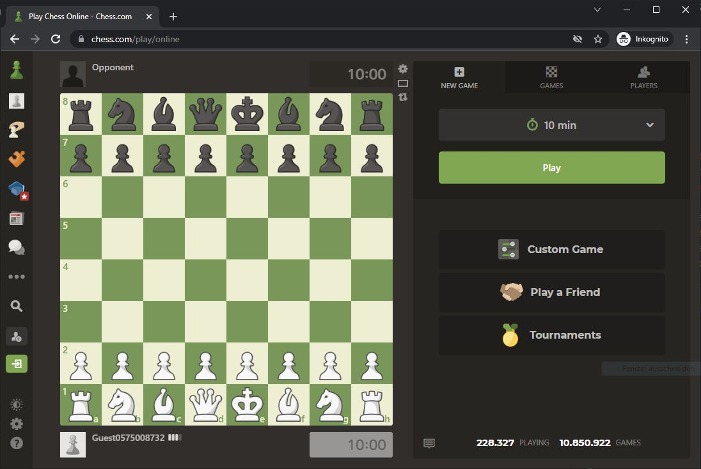

# Chess.com bot

The bot plays on chess.com for you.

It uses the Stockfish13 engine and image detection (opencv)

Download Stockfish engine [here](https://stockfishchess.org/), add it to the stockfish folder and put the filename in the


[Youtube video](https://youtu.be/17iM9LtQpU0) of the bot is playing


**Settings on chess.com:**
* Always Promote to Queen


### Board detection:


## Install libaries

```
pip install -r requirements.txt
```


## Config

* stockfish_path_name: the filename of the stockfish.exe


## Play

to start the script:
```
python -m bot.py
```

Detect the board before you start a game on this page:


Search for a game.
When found, start the bot.

It will show you the best moves for you by standard. You can check the "auto mouse control" checkbox if you want the bot to make your move.


## Warning

**The use of external software is forbidden on chess.com.**

**I don't recommend using this bot, because you probably get banned.**

**Use on own responsibility.**
